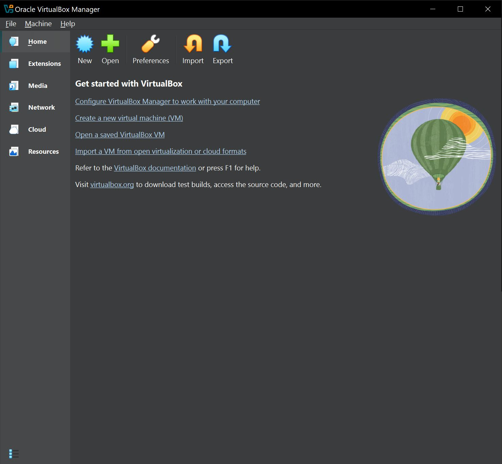
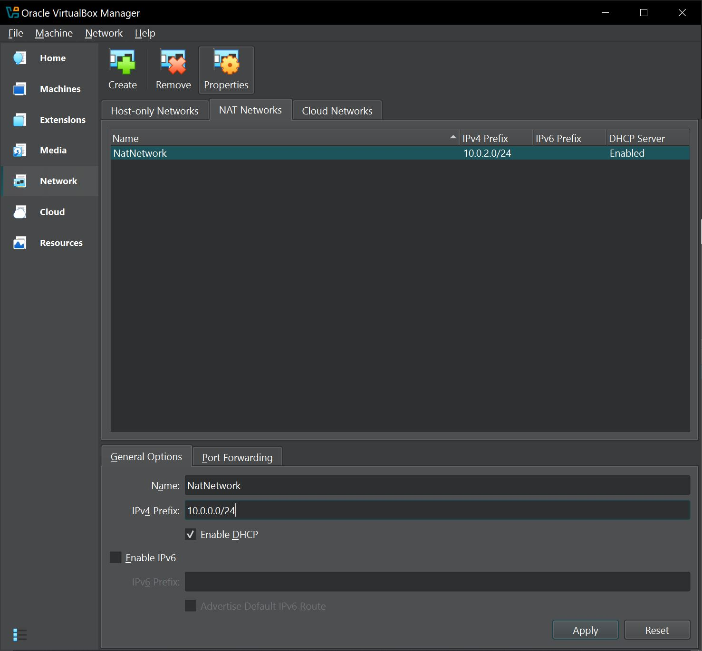
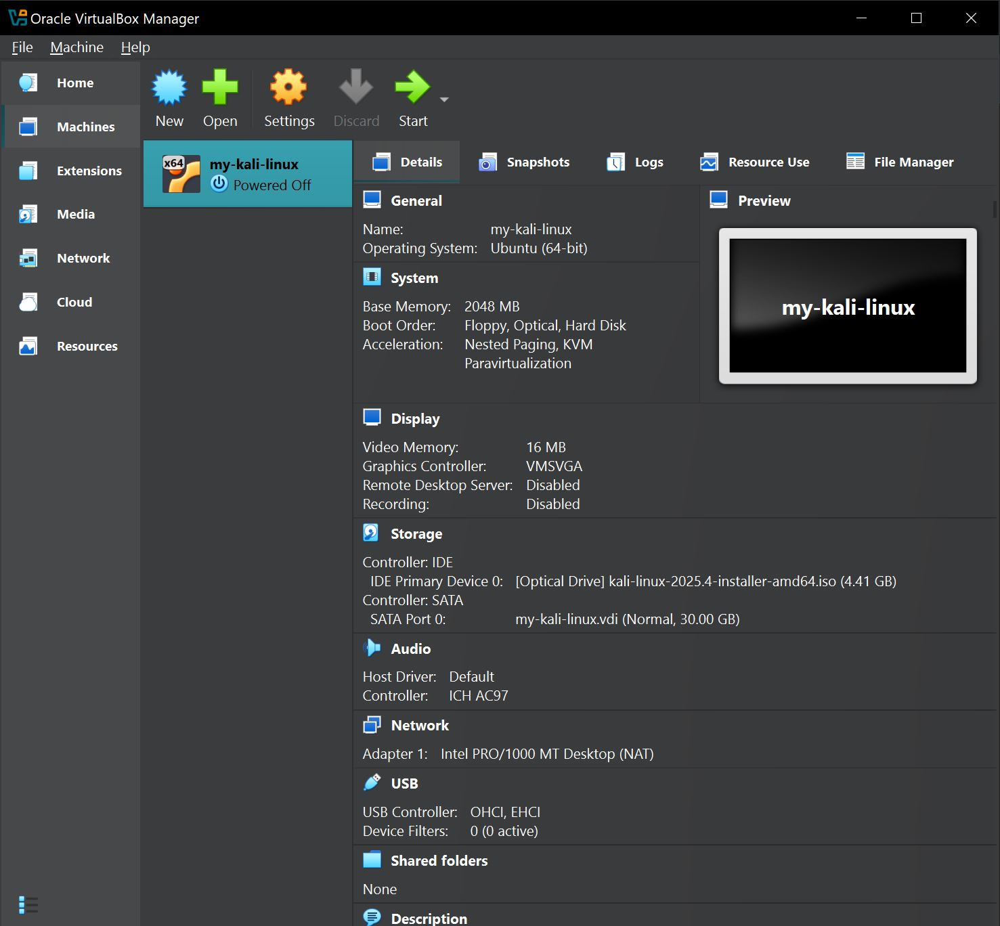
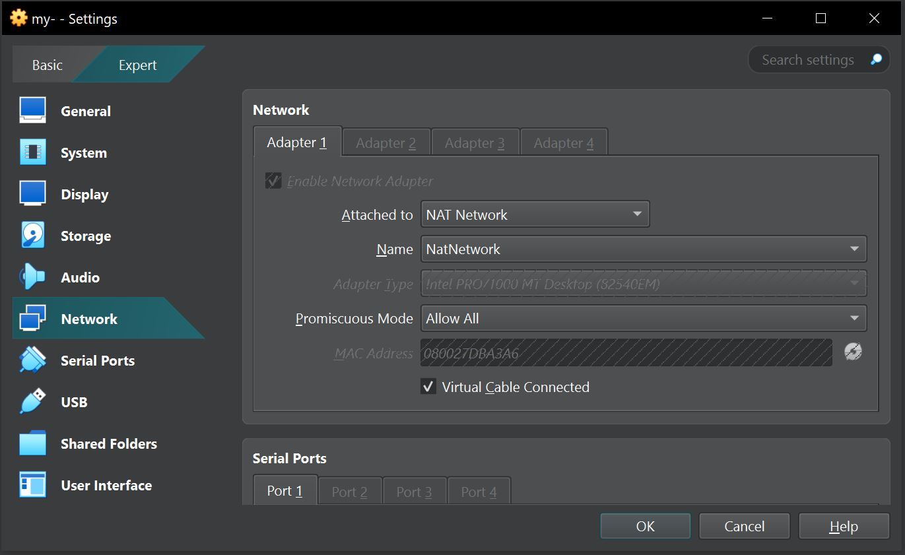
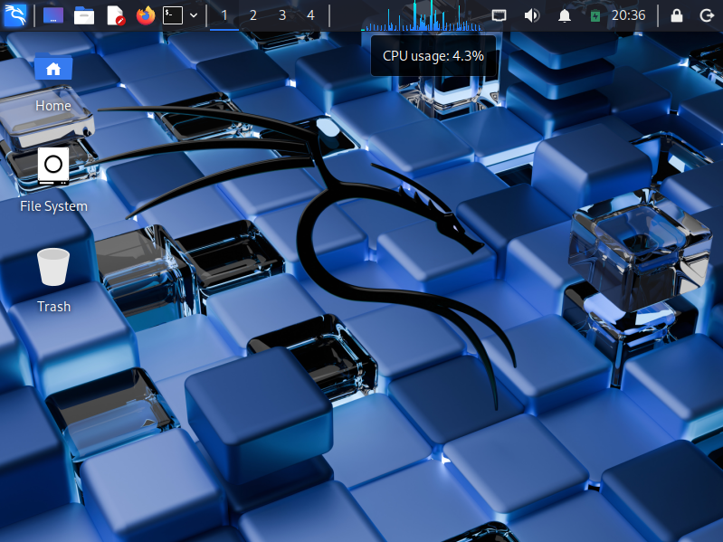
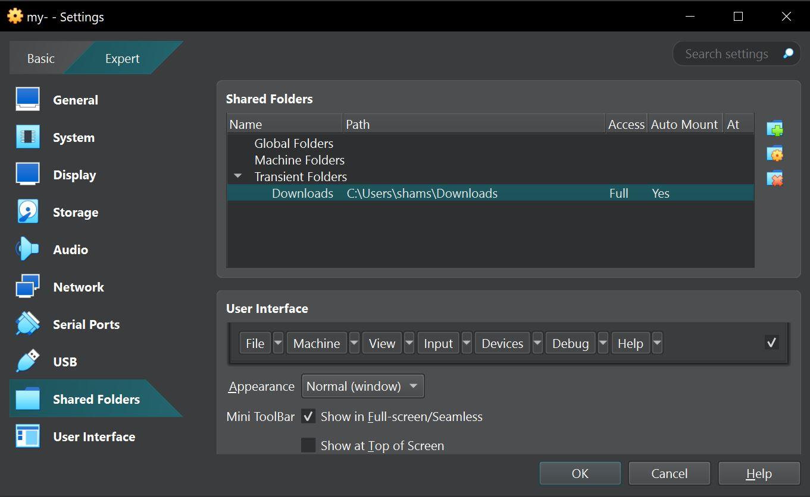
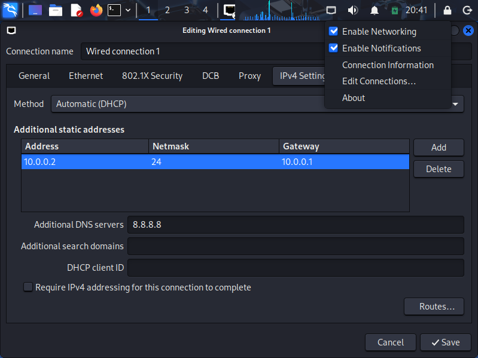
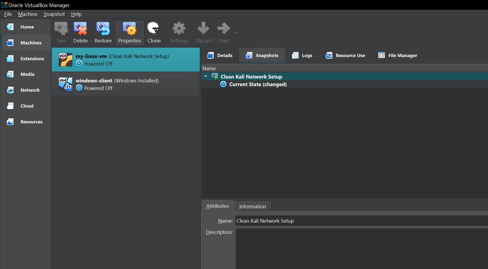
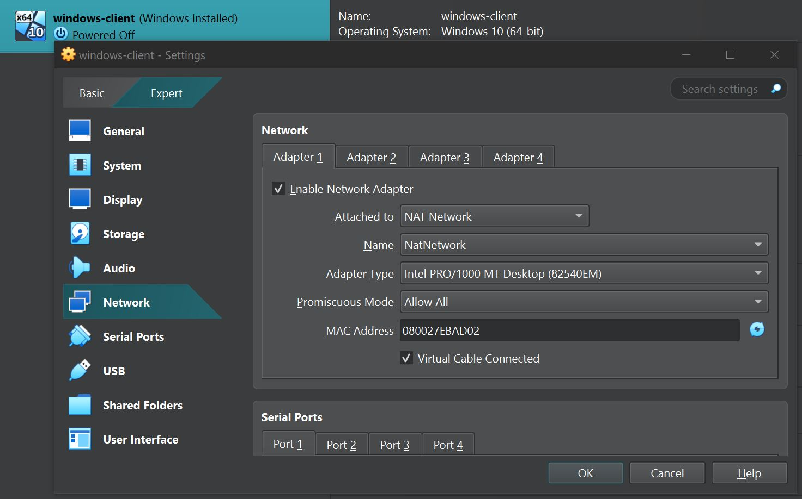
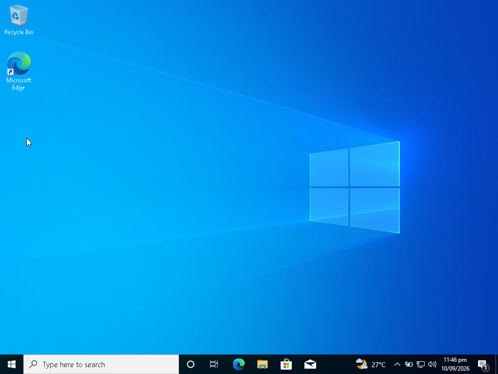

<div align="center">
# Week 1: Lab Environment Setup

Building an isolated virtual lab for penetration testing and ethical hacking practice
</div>

---

## Lab Overview

This week’s focus is setting up a **virtual cybersecurity and penetration-testing lab** using VirtualBox and Kali Linux.

The goal is to create a controlled environment for practicing security tools, network scanning, reconnaissance, and vulnerability assessment safely.

The lab uses a private virtual network so additional machines can be added later as targets for authorized testing.

## Objectives

The main objectives of this project are to:

- Install and configure VirtualBox.
- Install Kali Linux as a virtual machine.
- Create a private **NAT Network** for the cybersecurity lab.
- Configure network connectivity for Kali Linux.
- Assign a consistent IP address to the Kali VM.
- Verify network connectivity and DNS resolution.
- Take a clean VM snapshot for recovery.
- Document the complete setup process.
- Prepare the environment for future cybersecurity projects

## Purpose of the Lab

The lab provides an isolated environment for learning cybersecurity and performing authorized security testing.

It can be used for:

* Network reconnaissance and scanning
* Vulnerability assessment
* Packet analysis
* Web security testing
* Exploitation practice
* Security-tool experimentation

**Important:** Only test systems you own or have explicit permission to test. Never use these tools against unauthorized systems.

## Lab Configuration

| Component | Configuration   |
| ------------------ | ------------------ |
| Host OS         | *Windows 10*         |
| Host RAM        | *8 GB*               |
| Processor       | *Intel Core i7*      |
| Hypervisor      | *VirtualBox 7.2.2*  |
| Security OS     | *Kali Linux 2026.2*  |
| Kali RAM        | *2048 MB*            |
| Virtual Network | *NAT Network*        |
| Network Address | *10.0.0.0/24*        |
| Kali IP Address | *10.0.0.2/24*        |
| Default Gateway | *10.0.0.1*           |
| DNS Server      | *8.8.8.8*            |
| Future VM Range | *10.0.0.3–10.0.0.99* |


# Lab Setup Procedure

## Step 1: Install 7-Zip

7-Zip was installed to extract the Kali Linux virtual-machine package, which may be distributed as a `.7z` archive.

**Tool:** 7-Zip

---

## Step 2: Install VirtualBox

VirtualBox was installed as the hypervisor.



---

## Step 3: Create the NAT Network

A dedicated NAT Network was created in VirtualBox:


|   Network Name  |    NatNetwork |
|------|---------|
| IPv4 Prefix | *10.0.0.0/24* |
| DHCP | *Enabled* |
| IPv6 | *Disabled* |



A **NAT Network** was selected because multiple virtual machines connected to the same NAT Network can communicate with one another while also having outbound network connectivity. This will allow future attacker and target VMs to communicate within the lab.


---

## Step 4: Install Kali Linux

The Kali Linux virtual machine was downloaded from the official Kali Linux website and imported into VirtualBox.

The VM network adapter was configured as follows:

```text
Adapter 1
Attached to:    NAT Network
Adapter Type:   Intel PRO/1000 MT Desktop
Network:        NatNetwork
```

The VM was allocated:

```text
Memory: 2048 MB
Storage: 25 GB
Processors: 2
```







A shared folder was also configured for transferring required files between the host operating system and the Kali VM.



---

## Step 5: Configure the Kali Linux Network

The Kali Linux network configuration was checked and configured with a consistent IPv4 address.

Configuration:

```text
IP Address:         10.0.0.2
Subnet Mask:        255.255.255.0
Gateway:            10.0.0.1
DNS:                8.8.8.8
```

A consistent IP address makes it easier to document the lab and reference the Kali machine in future exercises.



---

## Step 6: Create a Clean VM Snapshot

After completing the initial configuration, a VirtualBox snapshot was created.

snapshot name:

```text
Clean Kali - Network Setup
```

The snapshot represents the clean baseline of the laboratory.

If a future exercise changes or damages the VM configuration, the machine can be restored to this baseline.



---

## Step 7: Install Windows 10 Client

The Windows 10 ISO was used to create a virtual machine in VirtualBox. You could download that using Microsoft's Media Creation Tool or any other trusted ISO website.

The VM network adapter was configured as follows:

```text
Adapter 1
Attached to:    NAT Network
Adapter Type:   Intel PRO/1000 MT Desktop
Network:        NatNetwork
```



The VM was allocated:

```text
Memory: 2048 MB
Storage: 30 GB
Processors: 2
```



Install Successful.

---

# Lab Verification

| Test | Command | Expected Result |
| ------------ | --------- | -------- |
| Check IP address | `ip a` | `10.0.0.2` | `10.0.0.2` |
| Default ateway | `ping 10.0.0.1` | Successful Replies              |
| Internet Connectivity | `ping 8.8.8.8`                  | Successful Replies              |
| DNS resolution        | `nslookup networkwalks.com`     | Domain Resolves                 |
| Verify Nmap                | `nmap --version`                | Nmap version: `7.95`          |
| Verify snapshot            | Restore snapshot & run `ip a` | Baseline configuration restored |


# What I Learned

Through this project, I learned how to create and configure a virtual environment for cybersecurity practice.

The most important concepts I learned include:

### 1. NAT vs NAT Network

A standard NAT configuration and a NAT Network serve different purposes.

A NAT Network allows multiple VMs connected to the same virtual network to communicate with one another while providing network address translation for external connectivity.

This makes it useful for building a multi-machine cybersecurity laboratory.

### 2. Virtual Machine Networking

I learned how VirtualBox virtual network adapters connect virtual machines to different types of networks and how network configuration affects communication between machines.

### 3. Static IP Configuration

I learned how to configure and verify IPv4 addressing, subnet masks, gateways, and DNS settings in Kali Linux.

### 4. VM Snapshots

I learned that a clean snapshot should be created **before performing risky or experimental activities**.

This provides a known-good recovery point for future cybersecurity exercises.

### 5. Documentation

I learned that documenting commands, configuration, screenshots, problems, and solutions is an important part of a professional cybersecurity project.

---

## Security & Ethical Use

This laboratory is intended strictly for education purposes only.

---

## Tools & Resources

- 7-Zip: [https://7-zip.org/download.html](https://7-zip.org/download.html)
- VirtualBox: [https://virtualbox.org/wiki/Downloads](https://virtualbox.org/wiki/Downloads)
- Kali Linux: [https://kali.org/get-kali](https://kali.org/get-kali)

---

## Author

Sham Sunder\
Cybersecurity B083D